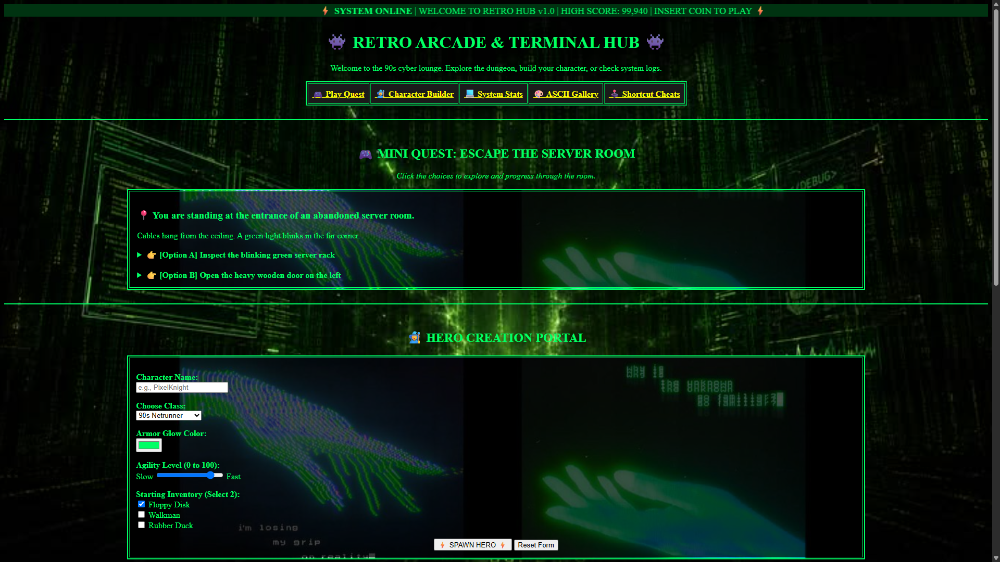

# 👾 Chamber of HTML | Retro Arcade & Terminal Hub

<pre>
   ._________________.
   |.---------------.|
   ||  RETRO TERMIN ||
   ||  ONLINE       ||
   ||_______________||
   /.-.-.-.-.-.-.-.-.\
  /.-.-.-.-.-.-.-.-.-.\
 / :::::::::::::::::: \
/______________________\
</pre>

> **⚡ SYSTEM ONLINE | WELCOME TO THE 90s CYBER LOUNGE | HIGH SCORE: 99,940 ⚡**

An authentic retro cyber experience featuring interactive text-based dungeon quests, avatar creation, live hardware monitors, and classic ASCII art.

---

## 🌐 Live Website

🎮 **Play Now:** [https://mantisdarling.github.io/Chamber-of-html/](https://mantisdarling.github.io/Chamber-of-html/)

---

## 📸 Preview



---

## 🌟 Interactive Modules

### 🎮 1. Mini Quest: "Escape the Server Room"
- A branching text adventure through an abandoned 90s server facility.
- Multi-choice decision tree: inspect blinking server racks, unlock vaults, or battle rogue AI.

### 👤 2. Cyber-Avatar Creator
- A retro form to register your digital persona.
- Choose your class (Hacker, Cyber-Ninja, Console Cowboy) and select your starting gear.

### 📊 3. System Hardware Monitor
- Live-looking progress bars and meters tracking CPU load, memory usage, and mainframe temperature.

---

## 💻 Local Setup

Want to run the terminal locally on your own mainframe?

1. **Clone the repository:**
   ```bash
   git clone https://github.com/mantisdarling/Chamber-of-html.git
   ```

2. **Launch the terminal:** Open `index.html` in any web browser.

---

<div align="center">
  <p>⭐ GAME OVER • INSERT COIN TO RESTART • © 2026 Retro Terminal Project ⭐</p>
</div>
